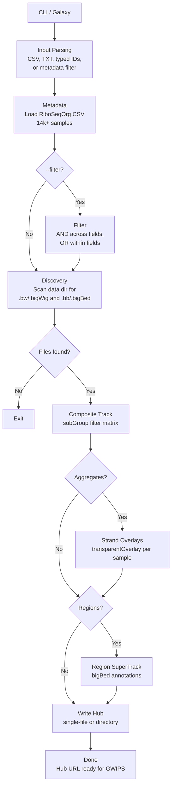

# RiboHub

A Python CLI tool that generates [UCSC Genome Browser](https://genome.ucsc.edu/) track hubs from RiboSeq bigWig and bigBed files. Built for use with [GWIPS-viz](https://gwips.ucc.ie/) and [RiboGalaxy](https://ribogalaxy.genomicsdatascience.ie/).

RiboHub reads a directory of sorted bigWig/bigBed files, pairs them with RiboSeqOrg metadata and outputs a ready-to-serve track hub with composite filtering, strand-overlay aggregates and region annotations.

## Pipeline



## Installation

```bash
pip install .
```

For development (edits take effect immediately):

```bash
pip install -e .
```

### Dependencies

Python 3.10+ with **click** and **trackhub** (installed automatically).

## Quick Start

```bash
ribohub generate \
  --data-dir ./data \
  --output-dir ./hub_output \
  --base-url http://your-server.com/data \
  --metadata ./RiboSeqOrg_Metadata.csv \
  --samples SRR9295900,SRR9295905,SRR9295906 \
  --with-aggregates \
  --with-regions
```

## Data Layout

RiboHub expects bigWig files organized by SRR ID:

```
data/
├── SRR929/
│   └── 59/
│       ├── SRR9295900_pshifted_forward.bw
│       ├── SRR9295900_pshifted_reverse.bw
│       ├── SRR9295900_pshifted_unique_forward.bw
│       └── SRR9295900_pshifted_multimapped_reverse.bw
└── SRR973/
    └── 70/
        └── SRR9737070_pshifted_forward.bw
```

Directory path: `{srr[:6]}/{srr[6:8]}/`. Files need `_forward` or `_reverse` in the name. The `_pshifted`, `_unique` and `_multimapped` parts are optional.

bigBed region files (`.bb`/`.bigBed`) are discovered alongside bigWig files when `--with-regions` is enabled.

## Track Hub Structure

**Composite track**: every (sample × strand × kind) combination as a subtrack. UCSC's `filterComposite` and `subGroups` let users interactively filter by sample, strand, kind and metadata dimensions.

**Aggregate tracks**: per-sample strand overlays using `transparentOverlay`. Forward and reverse strands at a glance.

**Region SuperTrack**: bigBed annotation tracks (e.g. ORFs) as a toggleable container.

## CLI Reference

```
ribohub [--verbose] generate [OPTIONS]
```

### Required

| Option | Description |
|---|---|
| `--data-dir` | Root directory of sorted bigWig/bigBed files |
| `--output-dir` | Where the hub gets written |
| `--base-url` | Public URL where data files are served |

At least one of `--samples` or `--filter` is also required.

### Sample Selection

| Option | Description |
|---|---|
| `--samples` | SRR IDs: single ID, comma list, `.txt` (one per line) or `.csv` (first column) |
| `--filter` | Select from metadata. `COL=VAL`, `COL=A\|B` (OR), comma-separated (AND) |

### Hub Configuration

| Option | Default | Description |
|---|---|---|
| `--genome` | `hg38` | Genome assembly |
| `--hub-name` | `RiboSeqHub` | Hub identifier |
| `--output-format` | `directory` | `directory` or `single-file` |
| `--metadata` | Auto-discovered | Path to RiboSeqOrg CSV |
| `--kinds` | `all,unique,multi` | Read types to include |
| `--with-aggregates` | Enabled | Strand overlays |
| `--with-regions` | Enabled | bigBed region tracks |
| `--strict` | Off | Fail on missing samples |
| `--dry-run` | Off | Preview without writing |

### Colors (Okabe-Ito defaults)

| Option | Default |
|---|---|
| `--color-fwd` | `#E69F00` (orange) |
| `--color-rev` | `#0072B2` (blue) |
| `--color-fwd-multi` | `#F0C566` (light orange) |
| `--color-rev-multi` | `#56B4E9` (light blue) |

## Docker Deployment

See [DOCKER.md](DOCKER.md) for the full Galaxy + Apache setup. Quick version:

```bash
cp .env.example .env    # fill in your paths and server IP
docker compose up -d --build
```

This starts Galaxy (tool interface) and Apache (hub serving) with a shared volume, hubs generated in Galaxy are instantly served by Apache.

## Galaxy Integration

RiboHub includes a Galaxy tool wrapper (`ribohub.xml`) with:

- Upload sample list, type SRR IDs or filter by metadata
- Checkboxes for aggregates, regions and read types
- Unique URL output per run (random folder)
- Genome assembly selection

## License

MIT

## Acknowledgements

Developed during a research internship at [LAPTI](https://lapti.ucc.ie/), School of Biochemistry and Cell Biology, University College Cork, under the supervision of Prof. Pavel Baranov.
